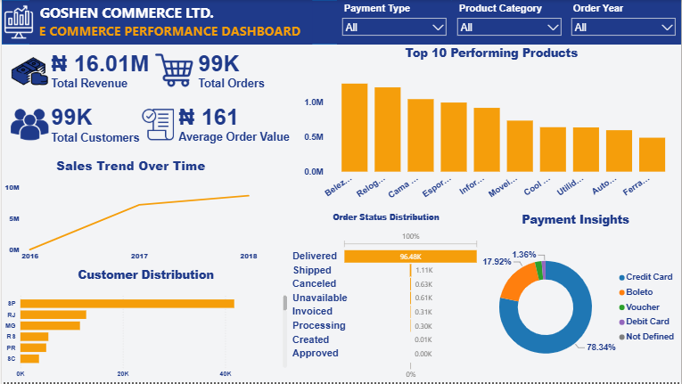
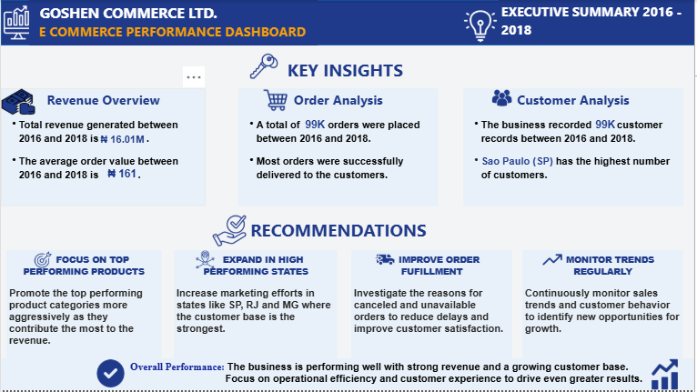

# Goshen Commerce Ltd. E-Commerce Performance Dashboard

## 📊 Project Overview

This project is an **E-Commerce Performance Dashboard** developed for **Goshen Commerce Ltd.** to analyze sales performance, customer behavior, order fulfillment, product performance, and payment trends between **2016 and 2018**.

The dashboard transforms e-commerce data into clear visual insights that can support management decision-making, performance monitoring, and business planning.

## 🎯 Project Objectives

The main objectives of this project were to:

* Analyze overall revenue and order performance.
* Understand customer distribution across different regions.
* Identify top-performing products and categories.
* Analyze order status and fulfillment performance.
* Examine customer payment preferences.
* Track sales trends over time.
* Generate actionable business insights and recommendations.

## 📈 Key Performance Indicators

| KPI                 |    Result |
| ------------------- | --------: |
| Total Revenue       |   ₦16.01M |
| Total Orders        |       99K |
| Total Customers     |       99K |
| Average Order Value |      ₦161 |
| Analysis Period     | 2016–2018 |

## 📊 Dashboard Features

### Sales Performance

The dashboard tracks sales trends over time, allowing users to evaluate changes in business performance between 2016 and 2018.

### Product Performance

The **Top 10 Performing Products** visualization highlights products with strong performance and provides insight into areas that may benefit from increased marketing attention.

### Customer Analysis

Customer distribution is analyzed across different states, with **São Paulo (SP)** recording the highest number of customers.

### Order Analysis

The dashboard provides a breakdown of order statuses, including:

* Delivered
* Shipped
* Canceled
* Unavailable
* Invoiced
* Processing
* Created
* Approved

### Payment Analysis

Payment methods are analyzed to understand customer payment preferences, including:

* Credit Card
* Boleto
* Voucher
* Debit Card
* Not Defined

### Interactive Filters

Users can explore the dashboard using filters for:

* Payment Type
* Product Category
* Order Year

## 💡 Key Insights

The analysis revealed that:

* The business generated approximately **₦16.01M in revenue** between 2016 and 2018.
* Approximately **99K orders** were placed during the period.
* The business recorded approximately **99K customers**.
* The average order value was approximately **₦161**.
* Most orders were successfully delivered.
* São Paulo (SP) had the highest customer concentration.
* Credit cards represented the largest share of payment methods.
* Product performance varied across categories, creating opportunities for targeted marketing.

## 🚀 Business Recommendations

### 1. Focus on Top-Performing Products

Increase promotional efforts for high-performing product categories to strengthen their contribution to revenue.

### 2. Expand in High-Performing States

Increase marketing efforts in states such as **São Paulo (SP), Rio de Janeiro (RJ), and Minas Gerais (MG)** where customer activity is strongest.

### 3. Improve Order Fulfillment

Investigate canceled and unavailable orders to identify operational issues and improve delivery reliability and customer satisfaction.

### 4. Monitor Trends Regularly

Regular analysis of sales and customer behavior can help management identify emerging opportunities and make informed business decisions.

## 🖼️ Dashboard Preview

### Main Dashboard



### Executive Summary



## 🛠️ Skills Demonstrated

* Data Analysis
* Data Visualization
* Dashboard Development
* Business Intelligence
* KPI Analysis
* Sales Analysis
* Customer Analysis
* Data Storytelling
* Business Reporting
* Insight Generation
* Business Recommendations
* Attention to Detail
* Information Organization

## 📁 Project Structure

```text
Goshen-Commerce-Dashboard/
│
├── dashboard.png
├── Insights.png
└── README.md
```

## 📌 Project Outcome

This project demonstrates the ability to transform business data into an understandable and decision-ready dashboard.

It combines **data analysis, business reporting, visualization, and administrative attention to detail** to present information in a format that can be quickly understood by business stakeholders.

## 👤 Author

**Gift Ogayemi**

**Executive Assistant | Junior Data Analyst**

Interested in using organization, analytical thinking, and data-driven insights to support efficient business operations and informed decision-making.
